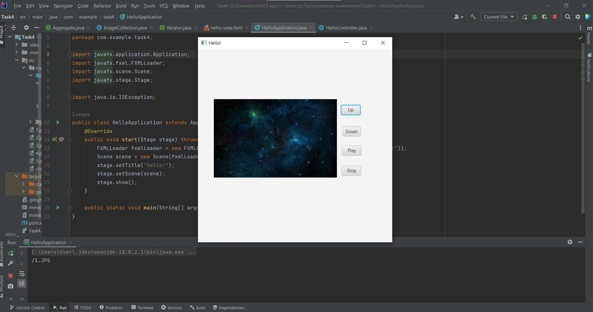

# Task 4
## В ходе выполнения задания, в практической работе были реализованы:
-   Пользовательский интерфейс по аналогии с плеером, включающим ImageView для  показа слайдов
-   Кнопки Вперед и Назад для переключения слайдов
-   Кнопки Запуска и Останова показа слайдов
-   Паттерн Итератор для навигации по структуре файлового каталога и его методы:
- -    hasNext() - возвращает  true, если все еще в структуре есть элементы для просмотра, и false, если не осталось ни одного
- -    next() - возвращает следующий элемент в структуре данных

